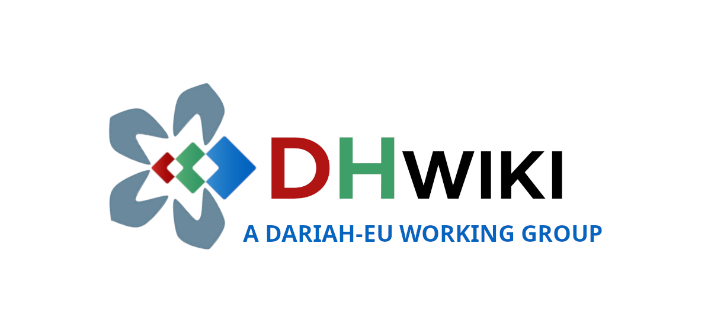

# DHwiki-notebooks

This is an example of reuse of the [DHwiki Wikibase](https://dhwiki.wikibase.cloud/wiki/Main_Page), hosted on [Wikibase Cloud](https://wikibase.cloud/), includes a Wikibase instance, and is maintained since September 2024 by the [DARIAH-EU WG DHwiki](https://www.dariah.eu/activities/working-groups/dhwiki/), in the framework of the [DARIAH ERIC](https://www.dariah.eu/). 

## Jupyter Notebook examples
- [Retrieve bibliographical items](https://nbviewer.org/github/hibernator11/dhwiki-notebooks/blob/main/notebooks/dhwiki-query-bibliographical-items.ipynb)
- [Retrieve classes and properties](https://nbviewer.org/github/hibernator11/dhwiki-notebooks/blob/main/notebooks/dhwiki-query-classes-properties.ipynb) 

## Running the notebooks
**To execute the notebook in Binder:**

- Click the launch binder button above. Once the demo launches, click My_sample_notebook.ipynb in the file listing.
- Run the notebook by selecting Cell > Run All. You call also click the play button to run the notebook cell by cell. You will the output of each cell.
- You can edit the cells, and click on play to run and see the changes.

## Licence
 Content is licensed under a <a rel="license" href="http://creativecommons.org/licenses/by/4.0/">Creative Commons Attribution 4.0 International license</a>.

## References

- https://glam-workbench.net/
-  Lindemann, D., Candela, G., Pellizzari di San Girolamo, C. C., Olea, I., Varvantakis, C., Schöch, C., Santiago Faria, A., Moitinho de Almeida, V., Assis, T., & Marchetti, A. (2025, junio 18). MediaWiki-based tools and services in Digital Humanities workflows. DARIAH Annual Event 2025 (DARIAH-AE2025), Göttingen, Germany. Zenodo. https://doi.org/10.5281/zenodo.15690771
-  Mahey, M., Candela, G., Holownia, O., Gabriels, N., & Chambers, S. (2025). GLAM Labs Annual Report 2024 (Final Version). Zenodo. https://doi.org/10.5281/zenodo.15096604
-  Candela, G. 2025. Browsing Linked Open Data in Cultural Heritage: A Shareable Visual Configuration Approach. J. Comput. Cult. Herit. 18, 1, Article 9 (March 2025), 15 pages. https://doi.org/10.1145/3707647
